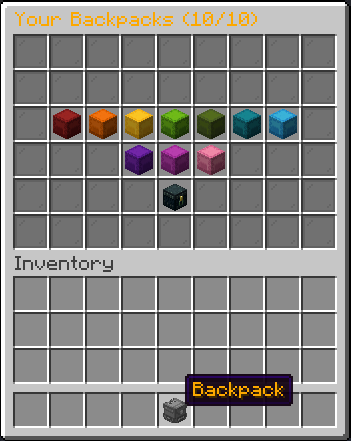
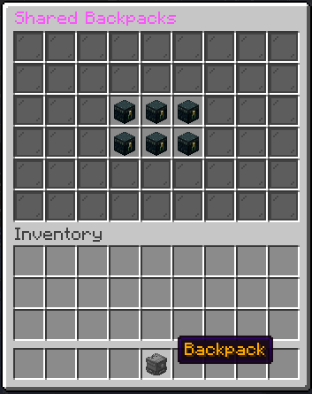
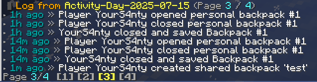

<h1 align="center">🎒 UltimateBackpacks</h1>
<p align="center"><strong>A modular, multilingual and fully customizable backpacks plugin for Minecraft Paper/Spigot servers.</strong></p>

<p align="center">
  
  
  
</p>

---

## 🌟 Features

- 🔢 Up to **10 virtual backpacks** per player (based on permissions)
- 🧍‍🤝‍🧍 **Shared backpacks** with full member and ownership management
- 🧠 Fully **NBT-safe** (supports custom items, enchantments, etc.)
- 💾 Supports **YAML**, **SQLite**, and **MySQL** backends
- 🌍 Multilingual support: 🇺🇸 English & 🇪🇸 Spanish
- ⚙️ Fully customizable GUI: colors, layout, and titles
- 🛡️ Prevents backpacks inside backpacks
- 🔐 Permission-based access control
- 🛠️ Admin commands: inspect, view, and manage backpacks
- 📜 Activity log viewer with click/hover support

---

## 📷 Screenshots

> Take a look at how UltimateBackpacks looks in-game!

| 🎒 Backpack Interface | 🤝 Shared Backpacks | 📜 Admin Logs |
|----------------------|--------------------|--------------|
|  |  |  |

---

## 📦 Installation

1. Download the `.jar` file or [compile it yourself](#-compiling-from-source).
2. Drop it into your server’s `/plugins/` directory.
3. Start or reload your server.
4. Edit `config.yml` and `messages.yml` to suit your needs.
5. Assign the correct permissions (see below).

---

## 🧩 Permissions

| Permission                         | Description                                                  |
|-----------------------------------|--------------------------------------------------------------|
| `ultimatebackpacks.limit.X`       | Allows player to own X backpacks (`0–10`)                    |
| `ultimatebackpacks.admin`         | Grants access to view/edit backpacks, logs, and shared data  |

---

## 🧪 Commands

| Command                                     | Description                                           |
|--------------------------------------------|-------------------------------------------------------|
| `/openbp`                                   | Opens your backpack selector GUI                     |
| `/ubp reload`                               | Reloads configuration and messages                   |
| `/ubp view <player> <number>`              | View a specific backpack of another player (admin)   |
| `/ubp viewshared <name>`                   | View contents of a shared backpack (admin)           |
| `/ubp log list`                            | Lists available log dates                            |
| `/ubp log view <date> [page]`              | Opens a detailed view of log events with pagination  |
| `/backpack newshared <name>`              | Creates a new shared backpack                        |
| `/backpack adduser <name> <player>`       | Adds a player to a shared backpack                   |
| `/backpack removeuser <name> <player>`    | Removes a player from a shared backpack              |
| `/backpack delshared <name>`              | Deletes a shared backpack                            |
| `/backpack transferowner <name> <player>` | Transfers ownership of a shared backpack             |
| `/backpack leave <name>`                  | Leave a shared backpack you were added to            |

---

## ⚙️ Configuration Overview (`config.yml`)

```yaml
language: en
allowNBT: true
allowBackpackInsideBackpack: false
allowSharedBackpacks: true
debugMode: false

storage:
  type: YAML  # Options: YAML, SQLITE, MYSQL

  sqlite:
    file: "backpacks.db"

  mysql:
    host: "localhost"
    port: 3306
    database: "minecraft"
    user: "minecraft"
    password: "minecraft"
    useSSL: false
    maxPoolSize: 10

gui:
  shulkerColors:
    top: [RED, ORANGE, YELLOW, LIME, GREEN, CYAN, LIGHT_BLUE]
    bottom: [PURPLE, MAGENTA, PINK]

WorldSettings:
  BlacklistWorlds:
    - "ExampleWorld"
````

---

## 🌐 Language Support

UltimateBackpacks includes built-in multilingual support via `messages.yml`.

🌍 Available languages:

* 🇺🇸 English (default)
* 🇪🇸 Spanish

Want to contribute a translation? Just copy `messages.yml`, translate the values, and submit a pull request!

---

## 💾 Storage Backends

Choose between three flexible storage modes:

### 🔹 YAML (Default)

* Player data stored in `userBackpacks/`
* Shared backpacks in `sharedBackpacks/`

### 🔹 SQLite

* Local file-based (`backpacks.db`)
* No external setup needed

### 🔹 MySQL

* Ideal for large-scale networks
* Requires connection info in `config.yml`

---

## 📁 Folder Structure

```
UltimateBackpacks/
├── config.yml
├── messages.yml
├── userBackpacks/
│   └── <uuid>.yml
├── sharedBackpacks/
│   └── <name>.yml
├── logs/
│   └── Activity-Day-YYYY-MM-DD.log
└── backpacks.db  # if using SQLite
```

---

## 🔨 Compiling from Source

> Requires **Java 17+** and **Maven**

```bash
git clone https://github.com/YourS4nty/UltimateBackpacks.git
cd UltimateBackpacks
mvn clean package
```

The compiled `.jar` will be available in `target/UltimateBackpacks-x.x.x.jar`.

---

## 🧑‍💻 Developer Info

* Java 17+
* Paper/Spigot API
* Modular, extensible architecture
* Uses Bukkit Inventory/NBT safely
* Easy to integrate with PlaceholderAPI or Vault (coming soon!)

---

## 🔗 Connect with Me

* 📸 Instagram: [@YourS4nty](https://instagram.com/YourS4nty)
* 💖 Donate via PayPal: [paypal.me/YourS4nty](https://www.paypal.me/YourS4nty)

---

## 📄 License

This project is licensed under the **MIT License**.
You are free to fork, modify, and contribute. Just don’t claim it as your own 😉

---
